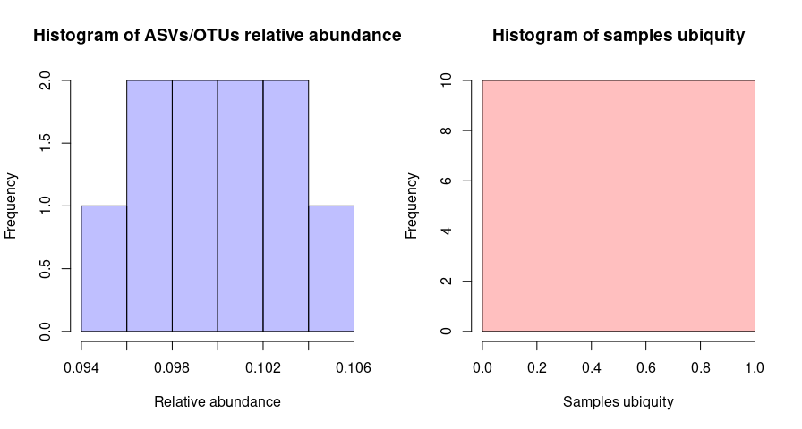

# coremicrobiota 

<!-- badges: start -->
[](https://github.com/Ebedthan/coremicrobiota/actions)
[](https://app.codecov.io/gh/Ebedthan/coremicrobiota?branch=main)
[](https://www.gnu.org/licenses/gpl-3.0)
<!-- badges: end -->

## A Simple Workflow for Core Microbiota Analysis

The goal of coremicrobiota is to provide a set of functions to easily perform core
microbiota analysis from an ASV/OTU table.

*  First, with the function [`sniff`](https://ebedthan.github.io/coremicrobiota/reference/sniff.html) you can rapidly get a glimpse at how many 
members compose your core microbiota with the given minimum relative abundance and
ubiquity. 
*  To have an idea of how to choose good values for your minimum relative abundance and ubiquity, you can make use of the [`distribution`](https://ebedthan.github.io/coremicrobiota/reference/distribution.html) function, which will
plot two histograms of distribution of both values across your dataset. 
*  Once, you are good to go you can now call the [`core_microbiota`](https://ebedthan.github.io/coremicrobiota/reference/core_microbiota.html) function to extract ASV/OTU names 
composing your core microbiota (with their corresponding relative abundance across 
all the dataset and ubiquity if you want). 
*  Finally, we offer you a function [`core_heatmap`](https://ebedthan.github.io/coremicrobiota/reference/core_heatmap.html) to draw the ASVs/OTUs relative abundance across samples.
*  A utility function [`get_core_table`](https://ebedthan.github.io/coremicrobiota/reference/get_core_table.html) is also provided to compute total counts,
relative sequence abundance across all dataset and ubiquity for each ASV/OTU.

Yes, all the function can take as input a phyloseq object. When it is the case,
the function `core_microbiota` return a phyloseq object.

This package have no external dependencies for your joy. We therefore,
extensively use R Base and only few packages as suggests.

## Installation

You can install the development version of coremicrobiota like so:

``` r
# Install devtools package (if not already done!)
install.package("remotes")

# Load devtools package
library(remotes)

# Install coremicrobiota package
install_github("Ebedthan/coremicrobiota")
```

## Example

This is a basic example which shows you how to solve a common problem:

``` r
library(coremicrobiota)

# Some fake data
asv_tbl <- data.frame(sample1 = 1:10, sample2 = 10:1, sample3 = 80:89)
rownames(asv_tbl) <- paste0("ASV", "_", 1:10)

# First I want to know how many ASVs/OTUs are in my microbiota given
# a certain minimum relative abundance and ubiquity

sniff(asv_tbl)
#> 10 ASVs/OTUs were found as members of the core microbiota

# How can I choose a good value for relative abundance and ubiquity?
distribution(asv_tbl)
```


```r
# When I am good...
core_microbiota(asv_tbl, abundance = 0.1, ubiquity = 0.25)

#> [1] "ASV_6"  "ASV_7"  "ASV_8"  "ASV_9"  "ASV_10"

# When I am done with core microbiota analysis...
core_heatmamp(asv_tbl, asv_tbl, abundance = 0.1, ubiquity = 0.25)

# If I want a nice table to include in my paper...
get_core_table(asv_tbl)

sample1 sample2 sample3 total_counts ubiquity relative_abundance
ASV_1        1      10      80           91        1         0.09528796
ASV_2        2       9      81           92        1         0.09633508
ASV_3        3       8      82           93        1         0.09738220
ASV_4        4       7      83           94        1         0.09842932
ASV_5        5       6      84           95        1         0.09947644
ASV_6        6       5      85           96        1         0.10052356
ASV_7        7       4      86           97        1         0.10157068
ASV_8        8       3      87           98        1         0.10261780
ASV_9        9       2      88           99        1         0.10366492
ASV_10      10       1      89          100        1         0.10471204
```

Enjoy!

## Some great papers on designing a core microbiota analysis

*  Neu, A.T., Allen, E.E., Roy, K., 2021. Defining and quantifying the core microbiome: Challenges and prospects. PNAS 118. https://doi.org/10.1073/pnas.2104429118
*  Berg, G., Rybakova, D., Fischer, D., Cernava, T., Vergès, M.-C.C., Charles, T., Chen, X., Cocolin, L., Eversole, K., Corral, G.H., Kazou, M., Kinkel, L., Lange, L., Lima, N., Loy, A., Macklin, J.A., Maguin, E., Mauchline, T., McClure, R., Mitter, B., Ryan, M., Sarand, I., Smidt, H., Schelkle, B., Roume, H., Kiran, G.S., Selvin, J., Souza, R.S.C. de, van Overbeek, L., Singh, B.K., Wagner, M., Walsh, A., Sessitsch, A., Schloter, M., 2020. Microbiome definition re-visited: old concepts and new challenges. Microbiome 8, 103. https://doi.org/10.1186/s40168-020-00875-0
*  Astudillo‐García, C., Bell, J.J., Webster, N.S., Glasl, B., Jompa, J., Montoya, J.M., Taylor, M.W., 2017. Evaluating the core microbiota in complex communities: A systematic investigation. Environ Microbiol 19, 1450–1462. https://doi.org/10.1111/1462-2920.13647


